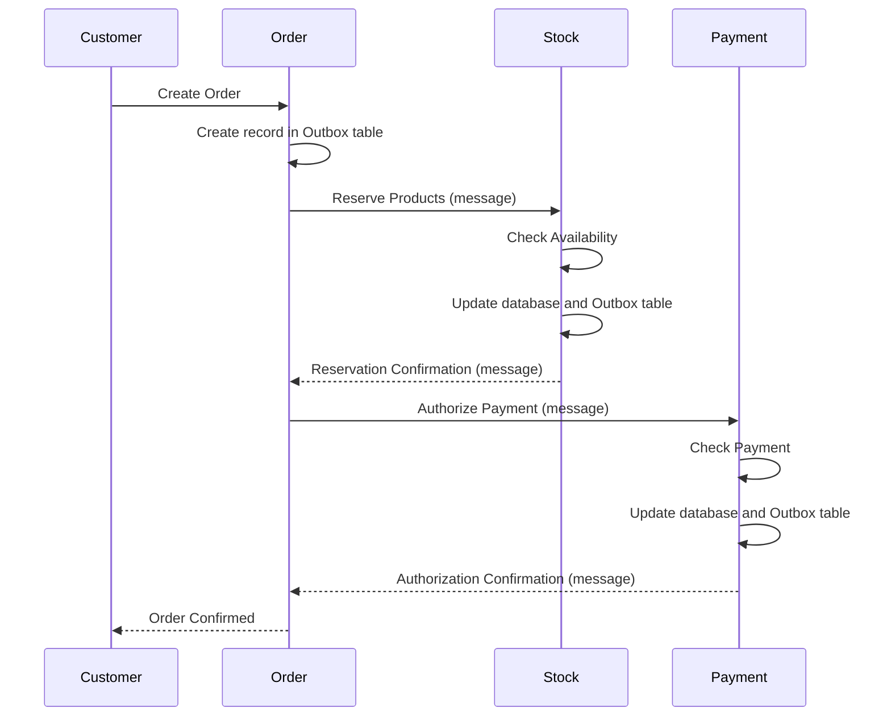

# 🌐 Saga with Outbox Pattern: Orchestrating Distributed Transactions in Microservices

This repository showcases the application of the Outbox Pattern in a microservices environment, specifically using the Django Outbox Pattern library developed at [@juntossomosmais](https://github.com/juntossomosmais/django-outbox-pattern).

### Scenario: Electronic Commerce System

Consider an e-commerce system adopting microservices (Order, Stock, and Payment) to manage orders, stock, and payments. The Saga pattern is implemented using the Outbox pattern for consistent communication between services.

* **Order (Order Service):**
    - Receives and processes customer orders.
    - Creates order records in the database upon order reception.

* **Stock (Stock Service):**
    - Manages product stock.
    - Receives a message from the Order service to reserve products in stock.
    - Confirms reservation, updates the database, and records a message in the Outbox table.

* **Payment (Payment Service):**
    - Processes order payments.
    - Receives a message from the Order service for payment authorization.
    - Validates payment, authorizes it, updates the database, and records a message in the Outbox table.

### Execution Flow:

1. Customer places an order through the Order service.
2. Order service creates a record in the Outbox table with order details.
3. Message is sent to the Stock service requesting product reservation.
4. Stock service checks availability, confirms reservation, updates its database, and records a message in the Outbox table.
5. Message is sent to the Payment service requesting payment authorization.
6. Payment service validates payment, confirms authorization, updates its database, and records a message in the Outbox table.
7. Order service periodically checks the Outbox table to process pending messages.
8. If all steps complete successfully, the order is marked as confirmed, and the customer is notified.

### Infrastructure for Django Applications

This repository includes configuration files for deploying three Django services (Order, Stock, Payment) on both Kubernetes and Docker Compose, each with its PostgreSQL database, and a RabbitMQ service for communication between services.

### Technologies Used

1. **Django:**
    - Web framework for rapid development of Python applications.

2. **PostgreSQL:**
    - Relational database management system.

3. **RabbitMQ:**
    - Messaging system supporting asynchronous communication between services.

4. **Kubernetes:**
    - Container orchestration platform for automation, scalability, and application management.

5. **Docker Compose:**
    - Tool for defining and running multi-container Docker applications.