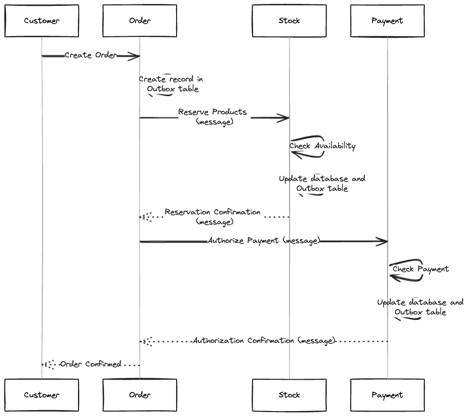
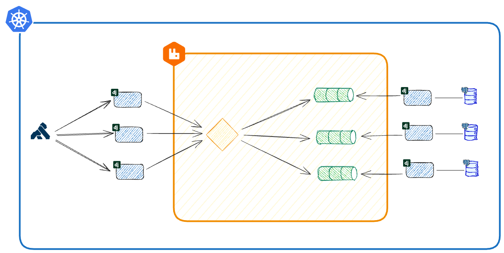

# 🌐 Saga with Outbox Pattern: Orchestrating Distributed Transactions in Microservices
[](README.md)
[](README.pt-br.md)

This repository demonstrates the Outbox Pattern in microservices, leveraging the Django Outbox Pattern library developed at [@juntossomosmais](https://github.com/juntossomosmais/django-outbox-pattern).

### 🎭 Scenario: E-Commerce System

An e-commerce system uses microservices (Order, Stock, and Payment) to manage orders, stock, and payments. The Saga pattern is implemented using the Outbox pattern for consistent communication.

* **📦 Order Service:**
    - Receives and processes customer orders.
    - Creates order records in the database upon order reception.

* **📦 Stock Service:**
    - Manages product stock.
    - Receives an order message to reserve products in stock.
    - Confirms reservation, updates the database, and records a message in the Outbox table.

* **💳 Payment Service:**
    - Processes order payments.
    - Receives an order message for payment authorization.
    - Validates payment, authorizes it, updates the database, and records a message in the Outbox table.

### ⚙️ Execution Flow:

1. Customer places an order through the Order service.
2. Order service creates a record in the Outbox table with order details.
3. Message is sent to the Stock service to reserve products.
4. Stock service confirms reservation, updates its database, and records a message in the Outbox table.
5. Message is sent to the Payment service for payment authorization.
6. Payment service validates payment, authorizes it, updates its database, and records a message in the Outbox table.
7. Order service periodically checks the Outbox table to process pending messages.
8. If successful, the order is marked as confirmed, and the customer is notified.



### 🏗️ Infrastructure 

This repository provides configuration files for deploying three Django services (Order, Stock, Payment) on Kubernetes and Docker Compose. Each service has its PostgreSQL database, and RabbitMQ facilitates communication. Kong serves as an API gateway and microservices management layer.



### 🛠️ Technologies Used

1. **Django:** A web framework for rapid Python application development.
2. **PostgreSQL:** A robust relational database management system.
3. **RabbitMQ:** Supports asynchronous communication between services.
4. **Kubernetes:** Container orchestration for automating deployment and scaling.
5. **Docker Compose:** Simplifies managing multi-container Docker applications.
6. **Kong:** An API gateway and microservices management layer.

## 🚀 Usage Instructions with Docker

### 🏁 Starting the Project

1. Navigate to the project root directory.

2. Run the start script:

    ```bash
    ./scripts/start.sh
    ```

3. Access services via:
   - Order Admin: [http://localhost:8000/admin](http://localhost:8000/admin)
   - Stock Admin: [http://localhost:8001/admin](http://localhost:8001/admin)
   - Payment Admin: [http://localhost:8002/admin](http://localhost:8002/admin)
   - API: [http://localhost:8080](http://localhost:8080)
   - Kong Admin: [http://localhost:8082](http://localhost:8082)
   - RabbitMQ Management UI: [http://localhost:15672](http://localhost:15672)

4. Use these credentials:
   - Django Admin: admin/admin
   - RabbitMQ: guest/guest

### 🧪 Testing Scenarios with Postman Collection

1. Install [Postman](https://www.postman.com/downloads/).

2. Import the Postman [collection](docs/saga.postman_collection.json).

3. Collection contains scenarios:
   - **Unreserved Stock:** Create order with quantity > 10.
   - **Denied Payment:** Create order with amount > $1000.

4. Run requests to observe system behavior.

### 🛑 Stopping the Project

1. Navigate to project root.

2. Run stop script:

    ```bash
    ./scripts/stop.sh
    ```

## 🚀 Usage Instructions with Kubernetes

**Note:** Kubernetes deployment instructions coming soon. Stay tuned!
