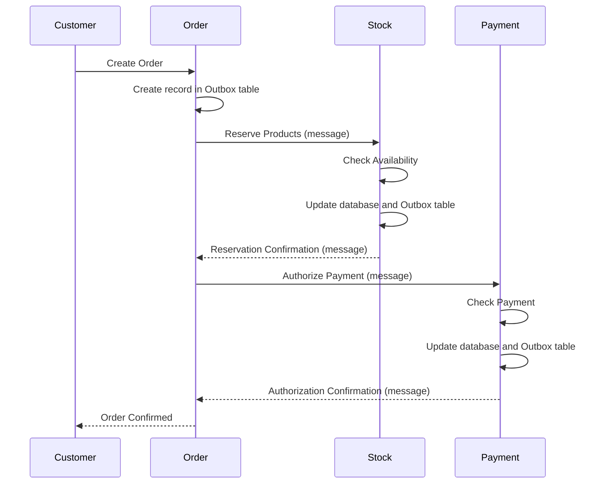

# 👋 Saga with Outbox Pattern: Distributed transactions with microservices.

When I worked [@juntossomosmais](https://github.com/juntossomosmais) I had the opportunity to develop [django-outbox-pattern](https://github.com/juntossomosmais/django-outbox-pattern) which is widely used by both JSM and the community. This repository aims to demonstrate, or at least try, how it would be used in a productive environment.

### Scenario: Electronic Commerce System

Imagine an e-commerce system that uses microservices architecture to manage orders, inventory, and payments. Let's call these microservices Order, Inventory and Payment. Furthermore, to implement the Saga standard, the Outbox standard will be used to ensure consistency between services.

* Order (Order Service):

Responsible for receiving and processing orders made by customers.
When a new order is received, it creates an order record in the database.

* Stock (Inventory Service):

Responsible for managing the stock of products available for sale.
Maintains information about the available quantity of each product.
When an order is created, the Order service sends a message to the Inventory service requesting the reservation of products in stock.

* Payment (Payment Service):

Responsible for processing order payments.
When an order is created, the Order service sends a message to the Payment service requesting payment authorization.
Implementation of the Saga Pattern using Outbox:

Each service (Order, Stock, Payment) has an Outbox table in its database.
When a transaction is carried out, a message is inserted into the Outbox table, containing the details of the operation.
A messaging service, such as RabbitMQ, is used to distribute these messages between microservices.

### Execution Flow:

1. A customer places an order through the Order service.
2. The Order service creates a record in the Outbox table with the order details.
3. A message is sent to the Inventory service requesting the reservation of products.
4. The Stock service checks product availability and confirms the reservation, updating its database and recording a message in the Outbox table.
5. A message is sent to the Payment service requesting payment authorization.
6. The Payment service checks the validity of the payment, confirms authorization, updates its database and records a message in the Outbox table.
7. The Order service periodically checks the Outbox table to process pending messages.
8. If all steps have been completed successfully, the order is marked as confirmed and the customer is notified.

In this way, the Saga pattern, together with the Outbox pattern, allows the coordination of distributed transactions between microservices, ensuring system consistency even in the face of failures or interruptions.

### Infrastructure for Django Applications on Kubernetes

This repository contains configuration files for deploying three Django services (Order, Inventory, Payment) on Kubernetes, each with its own PostgreSQL database and a RabbitMQ service for communication between the services.

### Technologies Used

1. **Django:**
    - Web framework for rapid development of Python applications.
    - [Official Website](https://www.djangoproject.com/)

2. **PostgreSQL:**
    - Relational database management system.
    - [Official Website](https://www.postgresql.org/)

3. **RabbitMQ:**
    - Messaging system to support asynchronous communication between services.
    - [Official Website](https://www.rabbitmq.com/)

4. **Kubernetes:**
    - Container orchestration platform for automation, scalability and application management.
    - [Official Website](https://kubernetes.io/)

### Project Structure

- **`order-service-deployment.yaml`:** Deployment and Service configuration for the Order service.
- **`inventory-service-deployment.yaml`:** Deployment and Service configuration for the Inventory service.
- **`payment-service-deployment.yaml`:** Configuration of Deployment and Service for the Payment service.
- **`postgres-deployment.yaml`:** Deployment and Service configuration for the PostgreSQL database.
- **`rabbitmq-deployment.yaml`:** Deployment and Service configuration for the RabbitMQ service.

### Instructions for Use with Kubernetes

1. Make sure you have Kubernetes installed locally or configured for remote access.
2. Run the following commands to deploy the services:

    ```bash
    kubectl apply -f order-service-deployment.yaml
    kubectl apply -f inventory-service-deployment.yaml
    kubectl apply -f payment-service-deployment.yaml
    kubectl apply -f postgres-deployment.yaml
    kubectl apply -f rabbitmq-deployment.yaml
    ```

3. Wait until the pods are running:

    ```bash
    kubectl get pods
    ```

4. The services will be accessible at the following addresses:

    - Order: `http://localhost:8000`
    - Stock: `http://localhost:8001`
    - Payment: `http://localhost:8002`

### Instructions for Use with Docker Compose

1. Make sure you have Docker Compose installed locally.
2. Run the following command to start the services locally:

    ```bash
    docker-compose up
    ```

3. The services will be accessible at the following addresses:

    - Order: `http://localhost:8000`
    - Stock: `http://localhost:8001`
    - Payment: `http://localhost:8002`

4. To stop the services, press `Ctrl+C` in the terminal and run:

    ```bash
    docker-compose down
    ```

